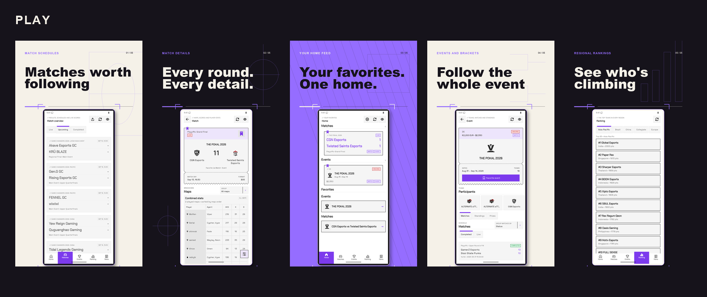

# Valorant Esports

An independent, unofficial companion for competitive Valorant. Follow matches, scores, events, rankings and news, and keep your favorites together.



Formerly **VLR.gg (Unofficial)**. The Android package remains `dev.staticvar.vlr`, so existing users can upgrade without installing a separate app.

[Website](https://valorantesports.staticvar.dev/) · [Google Play](https://play.google.com/store/apps/details?id=dev.staticvar.vlr) · [Open beta](https://play.google.com/apps/testing/dev.staticvar.vlr) · [GitHub releases](https://github.com/static-var/vlr-gg/releases) · [Privacy policy](https://valorantesports.staticvar.dev/privacy/) · [Terms](https://valorantesports.staticvar.dev/terms/)

[](https://github.com/static-var/vlr-gg/actions/workflows/internal_play_store_release_dispatcher.yml)

## Features

- Browse live, upcoming and completed matches, with scores, maps and match details.
- Explore events, brackets, standings, teams and players.
- Follow regional rankings and esports news.
- Favorite teams, players, matches and events to personalize Home.
- Hide scores when you want to watch without spoilers.
- Follow favorite matches from Android and iOS home screen widgets.
- Use layouts adapted for Android tablets and foldables.
- Read release highlights in Settings > What's new?

Favorites and settings are stored locally. The Android rewrite migrates supported favorites from the older app. No app account is required.

## Platforms and implementation

The active `kmp` branch targets **Android and iOS**. Android is available through Google Play; iOS is in development and is not yet publicly released.

The app uses Kotlin Multiplatform and Compose Multiplatform for shared application code and UI, with the Prism design system. Platform integrations include Glance widgets on Android and SwiftUI/WidgetKit widgets on iOS.

The current stack includes Koin, Ktor, Kotlin coroutines and serialization, SQLDelight, Navigation 3, and Sentry diagnostics. Older Android versions used Firebase; see the privacy policy for the differences in data handling.

## Project layout

| Module | Responsibility |
| --- | --- |
| `androidApp` | Android application and platform integration |
| `iosApp` | Xcode application and iOS widget extension |
| `shared` | Application composition, navigation and dependency wiring |
| `feature-*` | Home, matches, events, rankings, news, teams, players and settings |
| `designsystem` | Prism components, themes, typography and icons |
| `shared-ui` | UI shared across features |
| `domain` | Domain models and repository contracts |
| `data` | Repository implementations and refresh coordination |
| `remote-source` | Network clients and remote data sources |
| `local-source` | SQLDelight database and local persistence |
| `core` | Common utilities and telemetry contracts |
| `baselineProfile` | Android profile generation and user journeys |
| `build-logic`, `lint` | Build conventions and code checks |

The older `app/` module is retained as legacy source and is excluded from the active Gradle build.

## Local development

Use JDK 17 and an Android SDK matching the project's Gradle configuration. iOS development also requires macOS and Xcode. Follow [AGENTS.md](AGENTS.md) for repository-specific tooling and platform guidance.

Configure the Android SDK through `local.properties` or your environment. Backend access uses `VLR_AUTH_TOKEN`; Android also accepts `TOKEN` in `local.properties`. Keep credentials in local configuration or environment variables and out of version control.

Build the Android debug app from the repository root:

```sh
build-brief ./gradlew :androidApp:assembleDebug
```

If the machine-specific Java path in `gradle.properties` does not exist on your system, supply your JDK explicitly:

```sh
build-brief ./gradlew :androidApp:assembleDebug -Dorg.gradle.java.home="$JAVA_HOME"
```

For iOS, open `iosApp/iosApp.xcodeproj`, select the `iosApp` scheme and an iPhone or iPad destination, and configure signing for physical devices. The Xcode build integrates the shared Kotlin framework.

## Android releases and profiles

Release builds enable R8 code shrinking, obfuscation and resource shrinking. Saved Baseline and Startup Profiles are consumed during the build; R8 rewrites profile rules to match the optimized release code.

See [baselineProfile/README.md](baselineProfile/README.md) for generation commands, device requirements and covered journeys. Profile generation is separate from release builds.

The [beta workflow](.github/workflows/internal_play_store_release_dispatcher.yml) accepts a version name and an increasing Android version code. It builds a signed AAB, uploads it to the open-testing track, creates a GitHub release and sends the configured Telegram announcement. Changes must then be submitted for review in Play Console; an upload does not mean the update is available to users.

Play Store release notes live in [distribution/whatsnew/whatsnew-en-US](distribution/whatsnew/whatsnew-en-US) and must stay below 500 characters. In-app highlights live in [BundledRelease.kt](feature-about/src/commonMain/kotlin/dev/staticvar/vlr/featureabout/presentation/BundledRelease.kt). Keep both focused on changes users can understand. Change the bundled release identifier only when users should see a new announcement.

## Attribution and license

This project is not affiliated with or endorsed by Riot Games or VLR.gg. Valorant and related marks belong to their respective owners. Esports content and images remain subject to their owners' rights.

Thanks to [akhilnarang](https://github.com/akhilnarang) for the [VLR.gg scraper](https://github.com/akhilnarang/vlrgg-scraper) used by the original app.

Source code is available under the [MIT license](LICENSE). Third-party fonts and other assets retain their respective licenses.
