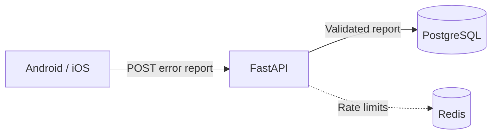

# Add a mobile error-reporting endpoint

Store enough context to diagnose Android/iOS loading failures by release, device, and API. The backend already uses FastAPI and Redis; add PostgreSQL for durable reports and keep Redis for rate limits.

## API

`POST /api/v1/error-reports/` with bearer authentication. Return `201 {id, received_at}` only after persistence; retrying the same `client_event_id` returns the existing ID. Conflicting payloads return `409`.

## Initial table: `error_reports`

| Fields | PostgreSQL types / purpose |
|---|---|
| `id`, `client_event_id` | UUID; server primary key and client retry identifier |
| `occurred_at`, `received_at` | TIMESTAMPTZ; client occurrence and server receipt |
| `platform`, `app_version`, `app_build` | TEXT; Android/iOS and release identification |
| `device_brand`, `device_model`, `os_version` | TEXT; nullable when unavailable |
| `screen`, `operation`, `had_cached_data` | TEXT, TEXT, BOOLEAN |
| `error_kind`, `error_type`, `error_message`, `stack_trace` | TEXT; full multiline client trace |
| `request_method`, `request_path`, `request_query` | TEXT, TEXT, JSONB; failed API and allowlisted query values |
| `response_status`, `response_body`, `backend_request_id` | SMALLINT, TEXT, TEXT; sanitized response and log correlation |
| `trace_truncated`, `response_truncated` | BOOLEAN |

Index receipt time, platform/version, and request path. Make the retry identifier unique within the authenticated app source. Store the source identifier, never its token.

## Behavior and checks

- Distinguish HTTP, network, timeout, parsing, and database errors. Response fields are null when no response arrived; parsing errors may have HTTP 200. Exclude cancellation.
- Require authentication, rate-limit ingestion, and cap requests at 256 KiB, traces at 64 KiB, responses at 16 KiB. Redact credentials; do not collect personal device names or identifiers.
- Add a migration, persistent DB storage/backups, and 30-day retention. Report-storage failure returns `503` without disrupting existing APIs. No public report-reading endpoint.
- Test Android/iOS metadata, multiline traces, duplicate retries, validation, redaction, and DB failure. Mobile submission is separate from the current local “Show details” UI.
